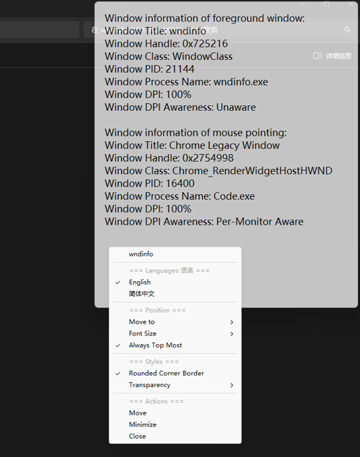

# wndinfo

Window information viewing tool for researching and debugging on Windows

Windows 系统下的窗口信息查看工具，用于学习和问题分析

## System requirement 系统要求
Windows 10 1607 or later

(Because of the usage of `GetWindowDpiAwarenessContext()`)

(因为使用了 `GetWindowDpiAwarenessContext()`)

## Usage 使用方法
- Run `wndinfo.exe`

   It displays the information of the foreground window as well as the information of the window where the mouse pointer is located

   它会显示最前端窗口的信息，以及鼠标指针所在位置的窗口的信息

- Right click to show the menu
  
   右键点击显示菜单

## Features 特色
- ✅Pure Win32 C/C++

    纯 Win32 C/C++
- ✅Showing Window title, handle, class name, process ID/name, DPI and DPI awareness

    可以显示窗口标题、句柄、类名、进程ID/名称、DPI和DPI感知
- ✅The program itself can be set language (English/Simplified Chinese), positions, font size, always on top, round corner border (Windows 11 only), and transparency

    程序本身可以设置语言（英语/简体中文），位置，字体大小，是否始终在顶部，圆角边框（仅 Windows 11）和透明度

## Build 构建
#### MSVC:

1. Go to Developer Command Prompt for VS or Developer PowerShell for VS
2. run build_MSVC.bat

#### MinGW:

1. run build_MinGW.bat
